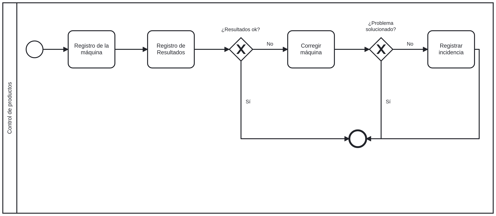

# Trabajo práctico 1

## Procesos de Negocio

## Requerimientos

### Funcionales

1. Registro de productos: El sistema debe permitir el registro de productos a controlar, incluyendo información como
   nombre del producto y características relevantes.
    2. Entre las características del producto se debe incluir las características a controlar, y las medidas que este
       debería tener normalmente
2. Registro de controles: El sistema debe permitir el registro de controles realizados en cada producto, capturando
   datos como el responsable del control, fecha y hora del control.
    3. Control de características: Se debe poder registrar los resultados de controles, tanto los visuales como los de
       medición.
5. Gestión de planillas: El sistema debe proporcionar una forma de gestionar y organizar las diferentes planillas
   utilizadas en los controles, evitando la dispersión de información y facilitando la búsqueda de datos.
9. Gestión de incidencias: El sistema debe permitir el registro de incidencias detectadas durante los controles,
   facilitando su análisis posterior por parte de los responsables correspondientes.
10. Seguimiento de correcciones: El sistema debe proporcionar una forma de realizar un seguimiento de las correcciones
    realizadas en las máquinas o herramientas, según las instrucciones establecidas en las hojas de control.

### No Funcionales

1. Eliminar la duplicidad de los datos y la necesidad de reingresarlos en diferentes ocasiones